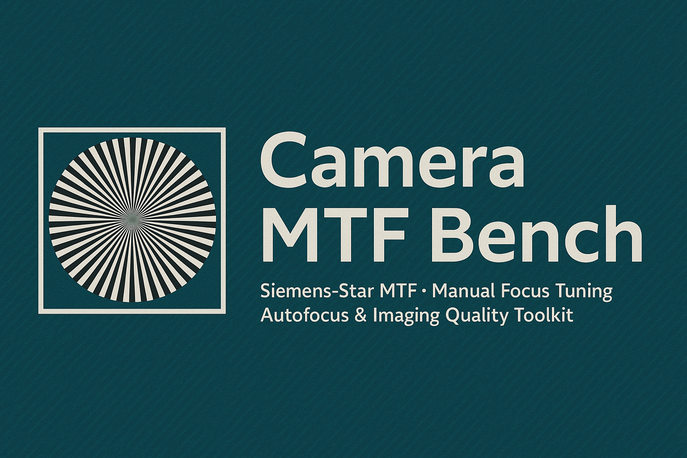

<p align="center">
  
</p>

<h1 align="center">Camera MTF Bench</h1>
<p align="center"><em>Siemens-Star MTF · Manual Focus Tuning · Autofocus & Imaging-Quality Toolkit</em></p>

<p align="center">
  
  
  
</p>

---

## 🌟 Overview

Camera MTF Bench is an optics-focused toolkit for evaluating imaging sharpness, focus behavior, and modulation transfer.It supports:

- **Manual focus workflows** (via Streamlit)
- **Simulated autofocus sweeps**
- **Siemens-star multi-radius MTF**
- **Gradient-based focus metrics**
- **CSV / PNG / JSON artifact export**
- **Camera + stage abstraction layers**
- **Real or simulated data**

Camera MTF Bench was originally designed for manual focusing of optical assemblies during development and prototyping of imaging modules. The Siemens-star structure, combined with gradient-derived metrics, allows real-time monitoring of focus quality, enabling fine mechanical adjustments while observing the optical response.

---

## ⚙️ Quick Start

### Install
```bash
git clone https://github.com/yourname/CAMERA-MTF-BENCH.git
cd CAMERA-MTF-BENCH
python -m venv .venv
.venv\Scripts\activate    # Windows
pip install -r requirements.txt
```

### Demo autofocus sweep (simulated data)
```bash
python -m bench demo-af --stack "data/focus_stack/*.png" --plot
```

### Compute Siemens MTF
```bash
python -m bench mtf-siemens --image data/frame.png --out outputs/mtf
```

### Full autofocus + MTF workflow
```bash
python -m bench focus-and-mtf --stack "data/focus_stack/*.png" --out outputs/run01
```

---

## 📂 Repository Structure

```text
CAMERA-MTF-BENCH/
│
├── bench/                     # Main Python package (instrumentation, metrics, workflows)
│   ├── __init__.py
│   ├── cli.py
│   ├── autofocus.py
│   ├── workflows.py
│   ├── workflows_hardware.py
│   ├── metrics/
│   ├── instruments/
│   ├── targets/
│   └── gui/
│
├── docs/                      # GitHub Pages documentation
│   ├── index.md
│   └── sections/
│       ├── index.md
│       ├── ...
│
├── assets/
│   └── img/
│       └── banner.png
│
├── data/
│   ├── charts/
│   └── focus_stack/
│
├── outputs/                   # Results from runs (gitignored)
│
├── requirements.txt
├── pyproject.toml
├── CONTRIBUTING.md
├── LICENSE
└── README.md
```

---

## 📘 Full Documentation

All detailed technical sections live under `/docs`.

- [Introduction](docs/sections/section0_intro.md)  
- [System Overview](docs/sections/section1_system_overview.md)  
- [Siemens vs Edge Targets](docs/sections/section2_siemens_vs_edge.md)  
- [Autofocus Metrics](docs/sections/section3_autofocus_metrics.md)  
- [Optical Bench Theory](docs/sections/section4_optical_bench.md)  
- [Software Modules](docs/sections/section5_software_modules.md)  
- [Manual Focus Workflow](docs/sections/section6_manual_focus.md)  
- [CLI Guide](docs/sections/section7_cli.md)  
- [Advanced Optics](docs/sections/section8_advanced_optics.md)  
- [Roadmap](docs/sections/section9_roadmap.md)  
- [Appendix](docs/sections/section10_appendix.md)  

---

## 📊 Example Outputs

Typical output artifacts (simulated sweep):

```
outputs/run01/
   autofocus_curve.csv
   autofocus_curve.png
   mtf_siemens_multi_radius.csv
   mtf_siemens_multi_radius.png
   summary.json
   best_focus_frame.png
```

---

## 🖥️ Hardware Backends

### Cameras
- OpenCV UVC camera  
- Dummy camera (image stack)

### Stages
- Dummy stage for initial development  
- VISA-style motion controller (skeleton)  
- Kinesis-style stage (skeleton)  

---

## 🎛️ Manual Focus (Streamlit)

The GUI provides:

- live preview  
- Siemens focus metric  
- Tenengrad / Laplacian metrics  
- incremental focus curve  
- best-focus visualization  

Ideal for manual tuning of prototypes and lens assemblies.

---

## 📄 License

See **[LICENSE](LICENSE)**.

## 🤝 Contributing

See **[CONTRIBUTING.md](CONTRIBUTING.md)**.

## 👤 Ali Pouya
Developd by Ali Pouya  
